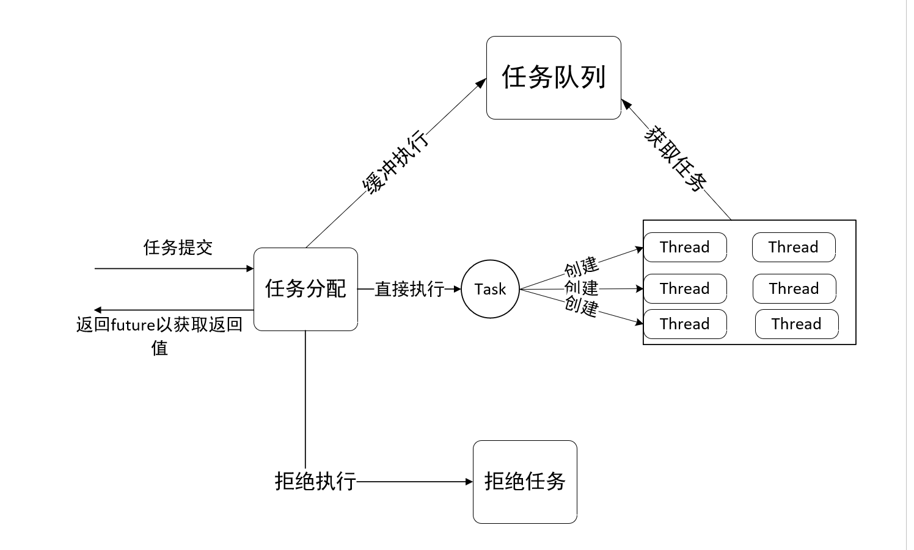

本文首先将简单的介绍线程池的概念和用途，然后介绍C++实现线程池需要用到的工具类和语言特性，最后一步一步带领读者使用C++实现一个简单的线程池。

### 1  线程池介绍

​	在程序设计中，线程池(thread pool)是一种实现并发执行的编程范式。它们也被称之为`replicated worker`、`worker-crew model`，一个线程池维护着多个等待任务的线程，该模型通过避免了频繁创建和销毁短期任务，来提高性能。使用者也可以根据计算机资源动态调整线程的数量。

​	一般来说使用线程池会带来很多好处：

+ 降低资源消耗：通过重用已创建的线程降低创建和销毁线程带来的消耗
+ 提高效应速度：当任务到达时，不需要新创建线程就可以执行
+ 利于管理：使用线程池可以对线程进行统一的 管理，调优和监控。

### 2 工具类

​	C++实现一个较为简单的线程池，需要用到`future`类，`function`类，`packaged_task`类 ，`bind`函数，`mutex`类，`conditional_variable`类和一些标准库容器，需要用到的C++特性有RAII，右值引用，变长模板参数 ，lambda表达式。

​	读者可以自行在[这里](https://www.cplusplus.com/)学习上述提到的类和函数，一般来说，看懂官方提供的示例就可以了。C++特性请自行搜索学习。请把这些知识弄明白后，再阅读下一节。

### 3 实现

github链接：https://github.com/pleasewhy/thread-pool

​	线程池的整体运行流程如下：



​	

​	在该实现，将函数作为任务，提交任务只需要将传递一个函数指针和其对应的参数，就可以将其交给线程池执行，它会返回一个`future`来异步地获取返回值。如何支持不同类型的函数，例如参数类型不同的函数，返回类型不同函数，类的成员函数，这是线程池首要解决的问题，也是实现的一个难点。

​	现在让我们来看看如何使用模板来解决这一个难点，ThreadPool::Execute的函数实现如下：

```c++
  template <class F, class... Args>
  auto Execute(F &&fn, Args &&... args) -> std::future<decltype(fn(args...))> {
    using RetType = decltype(fn(args...));
    auto task = make_shared<packaged_task<RetType()>>(
        bind(forward<F>(fn), forward<Args>(args)...)); // 将fn和args绑定
    auto future = task->get_future();

    // 将task包装成无返回值无参数的函数
    Runnable wraped_task = [task]() { (*task)(); };

    /**
     * 如果现在的worker数量小于core_pool_size_，就添加一个thread
     * 来执行当前的任务，并将该task作为它的first_task。注意AddWorker
     * 函数会保证再次判断，以保证不会错误添加worker。
     */
    if (worker_num_ < core_pool_size_) {
      if (AddWorker(wraped_task)) { //添加成功直接返回
        return future;
      }
    }
    /**
     * 将task添加到任务队列
     */
    if (AddTask(wraped_task))
      return future;
    throw TaskException();
  }
```

​	

​	首先看看该函数的定义，他拥有两个参数，第一个是函数指针类型，第二个是对应函数的参数，函数的参数使用了变长模板(为什么要使用右值引用呢？)，在最后使用`decltype`关键字来计算返回返回值。这样就可以传递任意类型的函数类型了。现在难点就变成了如何执行`fn`指向的函数，这里需要用到`packaged_task`类和`bind`函数。

`bind`函数会返回一个基于fn的函数对象，并绑定其参数。

```c++
tcemplate <class Fn, class... Args>
  /* unspecified */ bind (Fn&& fn, Args&&... args);
```

`packaged_task`类包装一个`Callable`元素，并可以通过`get_future`获取一个对应的`future`对象，这样就可以异步的获取函数的返回值。

现在就可以通过联合使用这两个工具，将传入的函数指针转换为"无参数"和"无返回值"的`Callable`对象，然后再使用`lambda`表达式将其包装为一个无参数，无返回值的函数。现在就统一了不同类型的函数了，线程只需要执行最后得到的函数就可以了。

现在让我们来看看如何设计`worker`类，以及如何添加worker。

```c++
class Worker {
  friend ThreadPool;

public:
  Runnable first_task;
  int worker_id;
  int completed_task;
  ThreadPool *thread_pool_;
  thread *my_thread;
  // 在后面实现
  Worker(ThreadPool *pool, Runnable first_task);
  ~Worker();
  void run(); // 在后面实现
};
```

worker类的核心是`run`方法，该函数会创建一个线程，并运行`RunWorker`函数，当线程进入`RunWorker`函数之后`worker`就初始化成功了。然后线程就会通过`GetTask`获取任务，`GetTask`会睡眠在`CV_`(条件变量)上，直到有人唤醒它，它每次醒来都会检查任务队列是否为空和线程池是否`shutdown`。当有新的任务添加到任务队列中时`Execute`会调用`cv_.notify_one`来唤醒一个`worker`，因为只有一个新增任务所以不用唤醒全部`worker`，否则可能会引起`羊群效应`。

```c++
void Worker::run() {
  my_thread =
      new thread(bind(&ThreadPool::RunWorker, _1, _2), thread_pool_, this);//_1,_2为占位符
}
void ThreadPool::RunWorker(Worker *worker) {
    Runnable task = worker->first_task;
    while (task != nullptr || (task = GetTask()) != nullptr) {
        task();
        worker->completed_task++;
        task = nullptr;
    }
    printf("worker=%d, complete tasks=%d\n", worker->worker_id,
           worker->completed_task);
}
```

到这里，读者应该知道了Worker如何执行任务了吧，现在就让我来看看如何`Shutdown`线程池。`Shutdown`实现比较简单，将stop设置为`true`后，唤醒所有线程，这里不会等待线程执行完成，`worker`的析构函数中，会调用线程的`join`函数，来等待线程执行完成。ThreadPool的析构函数中会默认摧毁所有`worker`实例，并调用其析构函数。

接下来，再来看看实现中可能会出现的线程安全问题，以及如何通过`mutex`和`conditional_variable`来解决这些问题。

`mutex`可以保证原子性互斥，一个锁一次只能被一个线程拥有，保证了临界区的代码 ，一次只能被一个线程执行。

```C++
mutex lock;
lock.lock();
// 临界区
lock.unlock()
```

线程池的实现中在使用了两个`mutex`，`workers_lock_`和`tasks_lock_`。前者用于保证原子地添加`worker`，以防`worker`数量大于设定的阈值，后者用于保护`task_queue`，用于保证原子地添加和取出任务，以防多个线程获取相同的任务。这里有一个小技巧，可以在作用域结束后，自动调用相应锁的`unlock`，不需要手动释放锁资源。

```c++
    { // 用于锁的RAII
      lock_guard<mutex> lock(workers_lock_);
      if (worker_num_ >= core_pool_size_) { // 防止虚假添加
        return false;
      }
      Worker *w = new Worker(this, first_task);
      workers_.push_back(unique_ptr<Worker>(w));
      w->run();
      worker_num_++;
    }
```

上述代码是`AddWorker`的部分，在第二行使用了声明一个`lock_guard`类型的局部变量，来包装`workers_lock_`，它会在自己的析构函数中来释放`workers_lock_`，这样在离开局部变量的作用域之后，就可以自动地释放锁资源了。

接下来介绍另外一种很有用的锁`condition_variable`，它是并发编程中的一种同步机制。条件变量使得线程能够阻塞到等待某个条件发生后，再继续执行。条件变量能够实现强大并且高效的同步机制，但是要用好条件变量，也需要我们做出不少努力。

在线程池的实现中，当`worker`没有任务可执行时，会一直等待，直到有新的任务到来，这里不是使用无限循环，来检查是否有新的任务到来 ，而是`sleep`等待有人唤醒它，这里的`sleep`并不会消耗任何资源。这里使用的就是条件变量的`wait`和`notify`方法。

```c++
// 该函数会在当前条件变量一直等待设置的等待条件触发
// __p为一个函数指针，每次被唤醒时，都会调用该函数，查询是否
// 结束等待,返回true为结束，false为继续等待
// __lock为一互斥锁，在每次检查条件时，都会先锁住__lock,再检查。
void  condition_variable::wait(unique_lock<mutex>& __lock, _Predicate __p);
void  condition_variable::notify_one(); // 唤醒wait在当前条件变量上的一个线程。
void  condition_variable::notify_all(); // 唤醒wait在当前条件变量上的所有线程。
```

现在让我们来看看线程池的实现中如何使用它

```c++
Runnable GetTask() {
    Runnable task;
    {
        unique_lock<mutex> lock(tasks_lock_);
        cv_.wait(lock,
                 [this] { return this->stop || !this->task_queue_.empty(); });
        if (stop) {
            return nullptr;
        }
        task = task_queue_.front();
        task_queue_.pop();
    }
    return task;
}
```

上面的代码在第二行使用了`unique_lock`包装`task_lock_`（注意这里会锁住`task_lock_`)，然后就是调用`cv_.wait`方法，将结束等待的条件设置为线程池结束和 `task_queue`不为空。只要这两种情况发生一种就会结束等待，注意，离开`wait`方法后是持有`tasks_lock_`锁的，当前作用域结束之后就会释放该锁。

~结束~